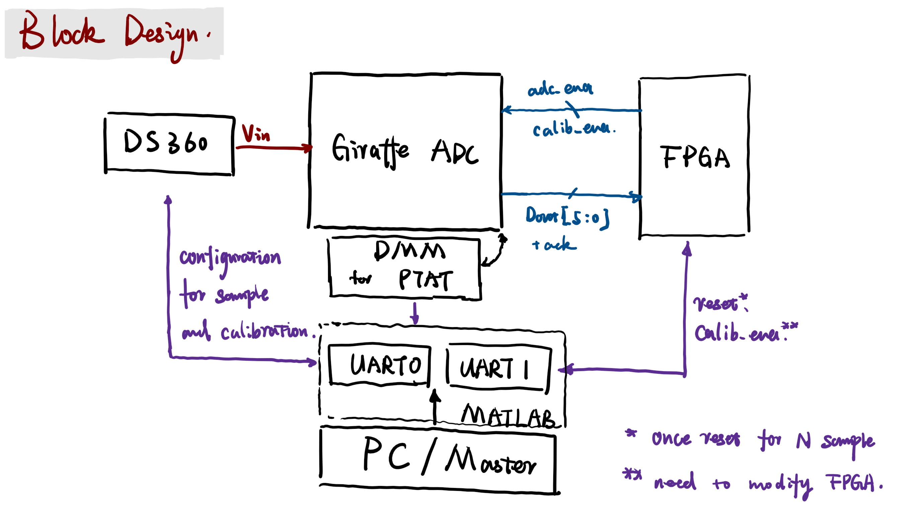
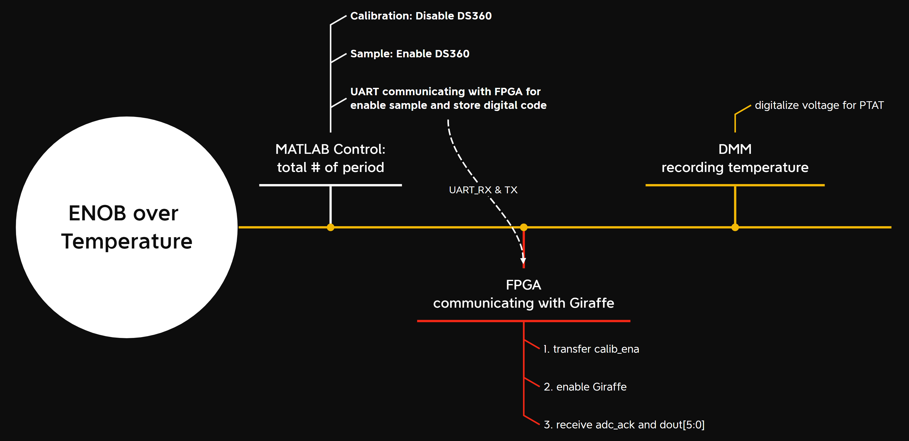

# Giraffe ADC Temperature

Verilog repository based on INTEL-Quartus for ENOB of Giraffe ADC over temperature varying.

---

## 问题描述

- **在环境温度 / 芯片温度变化时，级间放大器的闭环增益 $G_{A}$ 应当是变化的**。因此需要周期性地进行Calibration，例如在完成**2pi**相位的采样之后进行1次Calibration测量增益；
- 但是由于数字部分FSM描述存在bug，在进行Calibration的时候仍然会对输入的模拟信号进行一次Sample，导致第一次D/A之后的电压结果不可控，这样的电压再进行x16的放大会直接超出测量范围，导致无法进行Calibration；

$$V_{out,DA_{1}} = V_{in,sampled} ~ \pm ~  V_{LSB}$$
- 该bug已在Falcon中消除；

## 解决方法

- ==使用SCPI指令实现对信号源（DS360）的控制与配置，基于INL、DNL测试开发的Quartus代码，控制ADC进行周期性的Calibration and Sample.==

整体工作流如下：

- 以MATLAB代码为核心实例DMM control + 2\*UART device for communicating with FPGA and DS360;
	- 由MATLAB控制整个测试系统的工作周期（以M次Calibration + N次Sample为一个周期），循环计数完成；
	- MATLAB先通过**UART0**对DS360进行配置，关闭输出，随后通过**UART1**给FPGA `calib_ena` 信号以及 `reset` 信号触发FPGA中FSM重置，控制Giraffe ADC采样。这随后的数据链不做赘述，需要注意的是Calibration的次数与Sample的次数需要分开；
	- 随后再通过**UART0**对DS360配置，打开输出，之后的操作同上；
	- 与所有的Calibration & Sample 并行的是DMM对PTAT进行测量。

### 可能遇到的BUG与TODO
- [ ] FPGA的代码需要部分重构：
    - [ ] 将 **FSM** 与顶层分开，使得顶层只有模块的实例化；
	- [ ] 需要添加对`calib_ena`  `reset` 信号的reaction，目前只要是发送指令，不管是什么都会触发reset，没有区分度；
	- [ ] 添加对Calibration 和 Sample 的次数控制reg；
- [ ] UART0 控制DS360需要测试，目前没有只停留在理论可行阶段；
- [ ] 由于DMM的最低采样率为1kHz，因此关于温度的测量结果可能会远大于ADC的测量结果，**绘图结果的时候可能需要插值来实现对齐**；
